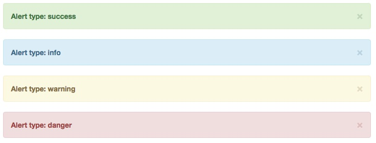
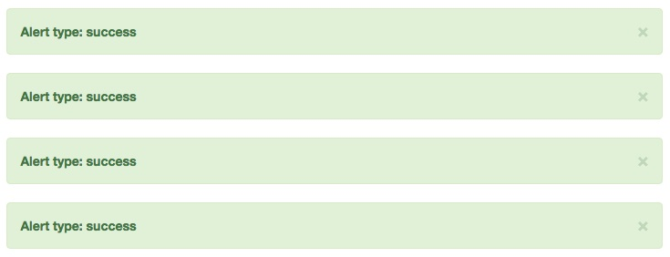

# Хелпер component_pack

**ВАЖНО**. *`component_pack` и параметр `cached: true` позволяют лишь в некоторых случаях пропускать перекомпиляцию одних и тех же шаблонов для технологии BEMHTML, дополнительно к этому обязательно используйте кэширование которое [доступно в Rails](http://rusrails.ru/caching-with-rails-an-overview)*.

Использование `component_pack` и `cached: true` может пригодиться только в том случае, когда один и тот же компонент(ы) нужно вывести в одном месте несколько раз (используя цикл), при этом шаблоны этого компонента или используемые внутри его вызовы других компонент не зависят от итераций, для всех итераций шаблоны у них будут одни и те же (нет динамических данных в шаблонах BEMHTML).

Для всех примеров используется файловая структура:
```
app/
  ├── assets/
  |     ├── javascripts/
  |     |     └── application.js
  |     └── stylesheets/
  |           └── application.css
  ├── bemer_components/
  |     ├── common/
  |     |     ├── alert/
  |     |     |     ├── index.html.slim
  |     |     |     ├── index.js
  |     |     |     └── index.css
  |     |     └── ...
  |     └── ...
  └── ...
```
Подключение технологий JavaScript и CSS компонента `alert` при использование Sprockets:

```js
// Файл app/assets/javascripts/application.js
//= require common/alert
```

```scss
// Файл app/assets/stylesheets/application.css
//= require common/alert
```

В качестве структуры компонента `alert` будет взят [компонент `alert` из библиотеки Twitter Bootstrap](https://getbootstrap.com/docs/3.3/components/#alerts):

```html
<!-- Исходная HTML структура компонента alert из библиотеки Twitter Bootstrap -->
<div class="alert alert-info alert-dismissible" role="alert">
  <button type="button" class="close" data-dismiss="alert">
    <span aria-hidden="true">&times;</span>
  </button>
  <strong>Warning!</strong> Better check yourself, you're not looking too good.
</div>
```
Возможный вариант разметки компонента `alert` по БЭМ методологии:
```slim
/ Содержимое файла index.html.slim компонента alert
= define_component bem_cascade: false do |component|
  = component.block :alert, tag: :div, cls: 'alert alert-dismissible', role: :alert do |alert|
    = alert.elem :close, type: :button, tag: :button, cls: :close, data: { dismiss: :alert }
      span aria-hidden='true' &times;
    = alert.elem :message, tag: false
      strong> Warning!
      | Better check yourself, you're not looking too good.
```
## Примеры

### Без использования `component_pack` с параметром `cached: true`

После каждой итерации, скомпилированные шаблоны компонента `alert` и шаблоны других компонент (в примере их нет), которые были созданы при вызове `render_component :alert` будут удалены, поэтому `cached: true` при вызове компонента `alert` не влияет на результат:
```slim
- %i[success info warning danger].each do |alert_type|
  = render_component :alert, cached: true do |template|
    = template.block(:alert).add_cls "alert-#{alert_type}"
      = template.elem(:message).content
        strong = "Alert type: #{alert_type}"
```


### С использованием `component_pack` без параметра `cached` (`cached: false`)

Если у компонента есть в шаблонах вызов других компонент с параметром `cached: true` или присутствуют [шаблоны по умолчанию (у `define_templates` по умолчанию параметр `cached` равен `true`)](Хелпер-define_templates.md) тогда для каждой итерации будут использоваться шаблоны из кэша (скомпилированные при первой итерации).

Шаблоны для компонента `alert` не кэшируются потому что не был передан параметр `cached: true`

```slim
= component_pack do
  - %i[success info warning danger].each do |alert_type|
    = render_component :alert do |template|
      = template.block(:alert).add_cls "alert-#{alert_type}"
        = template.elem(:message).content
          strong = "Alert type: #{alert_type}"
```


### С использованием `component_pack` и параметром `cached: true`

Для всех итераций используются шаблоны которые были получены при первой итерации:
```slim
= component_pack do
  - %i[success info warning danger].each do |alert_type|
    = render_component :alert, cached: true do |template|
      = template.block(:alert).add_cls "alert-#{alert_type}"
        = template.elem(:message).content
          strong = "Alert type: #{alert_type}"
```


